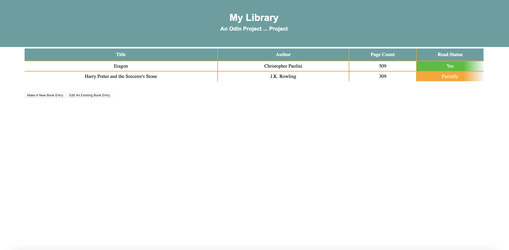

# Library

https://phoenix-99hp.github.io/Library/

This is a virtual library that allows the user to enter in book entries that will be populated in the display. Two sample entries are present at first to populate the display. When the user enters new book information into the pop-up module, regular expressions are used to indicate whether the entries are of the proper format. 

